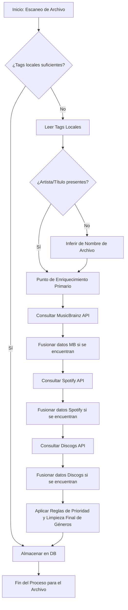

# Plan de Mejoras para el Enriquecimiento de Metadatos

## 1. Revisión del Flujo Actual y Puntos de Integración

El sistema actualmente:
1.  Escanea archivos de audio locales.
2.  Lee metadatos incrustados ([`core/metadata_reader.py`](core/metadata_reader.py)).
3.  Infiere artista/título del nombre de archivo si es necesario ([`core/library_scanner.py`](core/library_scanner.py)).
4.  Utiliza `enrich_metadata` ([`core/metadata_enricher.py`](core/metadata_enricher.py)) que ahora consulta MusicBrainz, Spotify y Discogs para campos como álbum, año, género, arte de portada e IDs, dando prioridad a los datos locales.
5.  Almacena los metadatos en la base de datos.

**Puntos de Integración Identificados:**

*   **Después del escaneo inicial y lectura de tags locales:** Este es el punto donde ya opera `enrich_metadata`. Se ha expandido esta función.
*   **Acción explícita del usuario:** Un botón "ENRICH" en la UI permite al usuario solicitar el enriquecimiento para la pista seleccionada.
*   **Proceso en segundo plano (opcional, configurable):** No implementado en esta fase, pero la arquitectura lo permitiría.

## 2. APIs Externas Sugeridas

### a. MusicBrainz (integración mejorada)

*   **Datos que provee:** Información exhaustiva sobre lanzamientos (álbumes, EPs, sencillos), artistas, relaciones entre ellos, fechas de lanzamiento, sellos discográficos, ISRC, etc. Es una base de datos comunitaria muy completa.
*   **Beneficios:**
    *   Alta precisión en datos de lanzamientos.
    *   Identificadores únicos (MBID) que pueden usarse para enlazar con otros servicios.
    *   Datos de relaciones (ej. miembros de una banda, versiones de una canción).
*   **Estrategia de Integración:**
    *   **Actual:** Se usa para álbum, año, género, artista, título, MBIDs (artista, grabación, lanzamiento) y arte de portada (vía Cover Art Archive).
    *   **Mejora:**
        *   Obtener y almacenar MBIDs para artistas, lanzamientos y pistas. **HECHO**
        *   Extraer información más detallada como sellos discográficos, país de lanzamiento (Potencial futura mejora).
        *   Utilizar los MBIDs para buscar en otras APIs (como Discogs o AcoustID) (Parcialmente hecho, se usan datos de track_info para Discogs).

### b. Spotify (integración mejorada)

*   **Datos que provee:** Catálogo extenso, popularidad, géneros (a nivel de artista y a veces de álbum/pista), arte de portada (múltiples resoluciones), fechas de lanzamiento, previews de audio, características de audio (bailabilidad, energía, tempo, tonalidad – aunque el tempo y tonalidad ya se extraen localmente).
*   **Beneficios:**
    *   Excelente fuente para arte de portada.
    *   Los géneros de Spotify, aunque a veces amplios, pueden ser un buen complemento.
    *   Características de audio pueden ser interesantes para análisis o playlists automáticas.
*   **Estrategia de Integración:**
    *   **Actual:** Se usa para género, año, álbum, artista, título, IDs de Spotify (pista, artista, álbum) y arte de portada.
    *   **Mejora:**
        *   Priorizar la obtención de **arte de portada** de alta calidad. **HECHO**
        *   Almacenar el Spotify ID de la pista/álbum/artista. **HECHO**
        *   Considerar la obtención de **previews de audio** si la UI lo permite (Potencial futura mejora).
        *   Evaluar la utilidad de las **características de audio** (energy, danceability) y si se deben almacenar (Potencial futura mejora).

### c. Discogs (nueva integración)

*   **Datos que provee:** Base de datos muy detallada sobre lanzamientos físicos y digitales, incluyendo versiones específicas (ej. "Japanese Limited Edition"), créditos detallados (productores, ingenieros, músicos de sesión), géneros y estilos muy granulares, imágenes de alta calidad de las ediciones físicas, precios de mercado (orientativo).
*   **Beneficios:**
    *   Información de versiones y ediciones muy específica.
    *   Créditos de producción y personal muy detallados.
    *   Comunidad activa que aporta datos de nicho.
    *   Excelente para coleccionistas o para identificar la proveniencia exacta de un máster.
*   **Estrategia de Integración:**
    *   **Nueva Integración:** **HECHO**
        *   Se usa después de MusicBrainz/Spotify, utilizando los datos de `track_info` (que pueden incluir datos de las otras APIs).
        *   Obtener **imágenes de alta calidad** de las ediciones. **HECHO**
        *   Extraer **estilos/géneros específicos**. **HECHO**
        *   Almacenar el Discogs Release ID. **HECHO**
        *   Extraer créditos detallados (Potencial futura mejora).

## 3. Diagrama de Flujo Propuesto para el Enriquecimiento

*Nota: El diagrama se simplificó para reflejar el flujo actual donde las APIs se consultan secuencialmente dentro de `enrich_metadata`.*

## 4. Desafíos y Consideraciones

*   **Límites de Tasa de API (Rate Limiting):**
    *   MusicBrainz es generoso pero pide no abusar (1 req/seg).
    *   Spotify tiene límites más estrictos que dependen del tipo de token y endpoint.
    *   Discogs también tiene límites.
    *   **Solución:** Se han implementado clientes básicos. Para uso intensivo, se necesitarían colas, reintentos con backoff exponencial y cacheo. Por ahora, el enriquecimiento es bajo demanda por pista.
*   **Mapeo de Datos y Consistencia:**
    *   Diferentes APIs tienen diferentes estructuras y granularidad para géneros, fechas, etc.
    *   **Solución:** Se ha definido un esquema interno en la DB. La lógica de fusión en `metadata_enricher.py` y la curación de géneros ([`_curate_genres`](core/metadata_enricher.py)) abordan esto.
*   **Manejo de Múltiples Resultados/Ambigüedad:**
    *   Las búsquedas pueden devolver varias coincidencias.
    *   **Solución:** Actualmente se toma el primer resultado. Mejoras futuras podrían incluir heurísticas o permitir al usuario elegir.
*   **Claves de API y Autenticación:**
    *   Spotify y Discogs requieren claves de API.
    *   **Solución:** Se utiliza `python-dotenv` para cargar claves desde un archivo `.env`. Se ha creado `.env.example`.
*   **Impacto en la UI:**
    *   Mostrar nuevos campos (arte de portada, IDs). **HECHO**
    *   Permitir acciones de enriquecimiento manual. **HECHO (botón "ENRICH")**
    *   Mostrar el origen de los datos (ej. "Género: Electrónica (Spotify)"). (No implementado explícitamente, pero la UI muestra los datos fusionados).
*   **Rendimiento:**
    *   Múltiples llamadas a APIs pueden ralentizar el enriquecimiento de una pista.
    *   **Solución:** El enriquecimiento se realiza en un hilo secundario para no bloquear la UI.
*   **Dependencia de Servicios Externos:**
    *   Las APIs pueden cambiar, dejar de funcionar o tener caídas.
    *   **Solución:** Se incluye manejo básico de errores en los clientes HTTP.
*   **Calidad de los Datos de Origen:**
    *   Si los tags locales son muy malos o incorrectos, las búsquedas en APIs pueden fallar o devolver resultados incorrectos.
    *   **Solución:** La función `_clean_text` en `metadata_enricher.py` ayuda a limpiar los términos de búsqueda.

## 5. Próximos Pasos (Implementación)

Una vez aprobado este plan:
1.  **Refinar el módulo `spotify_client.py`:** Asegurar que maneja la autenticación OAuth2 correctamente y expone funciones claras para buscar pistas, artistas y obtener arte de portada. - **HECHO**
2.  **Crear un nuevo módulo `discogs_client.py`:** Implementar la lógica para interactuar con la API de Discogs (autenticación, búsqueda, obtención de datos de lanzamientos). - **HECHO**
3.  **Expandir `metadata_enricher.py`:**
    *   Integrar las llamadas al nuevo `discogs_client.py`. - **HECHO**
    *   Mejorar la lógica de fusión de datos para incluir arte de portada, MBIDs, Spotify IDs, Discogs IDs, y otros campos nuevos. - **HECHO**
    *   Implementar la lógica de priorización configurable (ej. ¿qué fuente es prioritaria para el género si todas lo proveen?). (Priorización básica implementada, configuración avanzada no). - **HECHO (Básico)**
4.  **Modificar `library_scanner.py`:**
    *   Ajustar cómo y cuándo se llama a `enrich_metadata`. - **HECHO**
    *   Considerar añadir un parámetro para controlar el "nivel" de enriquecimiento (ej. básico, completo). (No implementado, el enriquecimiento actual es completo).
5.  **Actualizar `database.py`:** Añadir nuevas columnas a la tabla de pistas para almacenar los nuevos metadatos (MBIDs, Spotify IDs, Discogs IDs, URL de arte de portada, etc.). - **HECHO**
6.  **Modificar la UI:**
    *   Mostrar el arte de portada. - **HECHO**
    *   Mostrar los nuevos campos de metadatos. - **HECHO**
    *   Añadir opciones para el enriquecimiento manual/profundo. (Botón "ENRICH" implementado para la pista seleccionada). - **HECHO (Básico)**
7.  **Pruebas exhaustivas.** - **PENDIENTE** (Fase continua)
8.  **Crear archivo `.env.example`** para guiar al usuario en la configuración de credenciales de API. - **HECHO**

Este plan se enfoca en la estrategia y no en la implementación detallada del código, que se abordaría en un modo de "código".